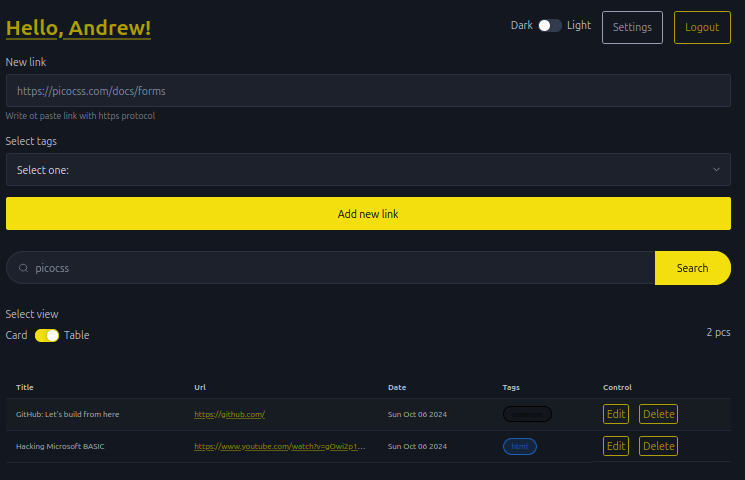
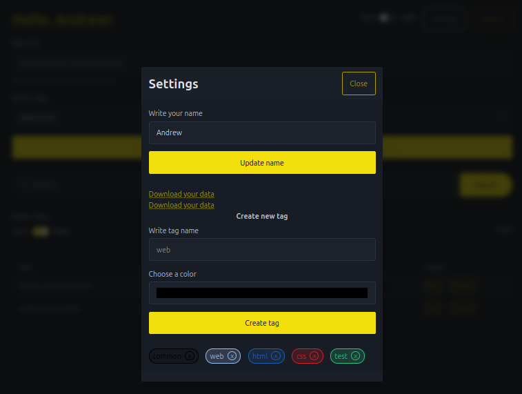

# Links





## Resources

- [bun](https://bun.sh/docs/api/sqlite)
- [hono](https://hono.dev/docs/guides/jsx)
- [HTMX](https://htmx.org/reference/#attributes)
- [Pico.css](https://picocss.com/docs)
- [alpine.js](https://alpinejs.dev/start-here)
- [The Open Graph protocol](https://ogp.me/)
- [open-graph-scraper](https://www.npmjs.com/package/open-graph-scraper)

### Resources for tests

- [hono cookie](https://github.com/honojs/hono/blob/main/src/helper/cookie/index.test.ts)
- [hono context](https://github.com/honojs/hono/blob/main/src/context.test.ts)

## Debug

Log every event that htmx triggers:

```javascript
htmx.logAll();
```

In chromium base browser in console, what events 
a DOM element is firing to use as a trigger:

```javascript
monitorEvents(htmx.find("#theElement"));
```

[List of supported URLs: **routes**](service.router.tsx#L21)  
[Commands for import user data to database: **import.sql.bash**](import.sql.bash)


## Example open graph protocol

```html
<title>The Rock (1996)</title>
<meta property="og:title" content="The Rock" />
<meta property="og:type" content="video.movie" />
<meta property="og:url" content="https://www.imdb.com/title/" />
<meta property="og:image" content="https://ia.media-imdb.com" />

<meta property="og:audio" content="https://example.com/bond/theme.mp3" />
<meta property="og:description" 
  content="Sean Connery found fame and fortune as the
           suave, sophisticated British agent, James Bond." />
<meta property="og:determiner" content="the" />
<meta property="og:locale" content="en_GB" />
<meta property="og:locale:alternate" content="fr_FR" />
<meta property="og:locale:alternate" content="es_ES" />
<meta property="og:site_name" content="IMDb" />
<meta property="og:video" content="https://example.com/bond/trailer.swf" />

<title>(528) Bullet Ricochets in Slow Motion! - YouTube</title>
<meta name="title" content="Bullet Ricochets in Slow Motion!">
<meta name="description" content="Full Video: https://youtu.be/ #firearms #science">
<meta property="og:site_name" content="YouTube">
<meta property="og:url" content="https://www.youtube.com/">
<meta property="og:title" content="Bullet Ricochets in Slow Motion!">
<meta property="og:image" content="https://">
<meta property="og:description" content="Full Video: https:// #firearms #science">
```
